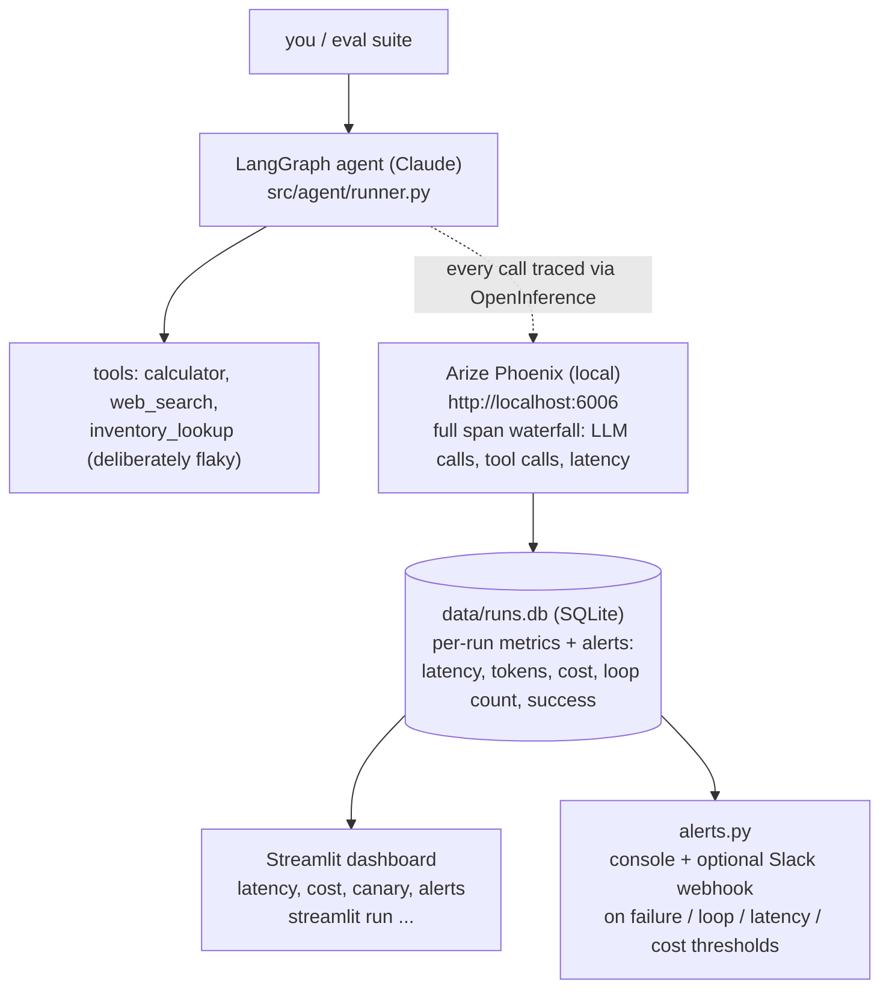

# Production Monitoring Agent

A Claude-powered LangGraph agent with a full production-observability layer
around it: distributed tracing, a latency/cost dashboard, alerting on loops
and failures, and canary testing with automatic rollback.

## Architecture



`config/agent_versions.json` holds two named agent configs — `stable` and
`canary` — plus an `active` pointer that decides which one serves real
traffic. `python scripts/run_canary.py` runs both against a fixed eval suite,
compares reliability/latency/cost, and flips `active` automatically
(promote or roll back) — no redeploy needed, the next interactive run just
picks up the new config.

## Setup

1. **Python 3.11+** and the virtual environment (already created at `.venv`
   if you're continuing this session):

   ```powershell
   python -m venv .venv
   .venv\Scripts\pip install -r requirements.txt
   ```

2. **Add your Anthropic API key.** `.env` was created from `.env.example` —
   open it and set:

   ```
   ANTHROPIC_API_KEY=sk-ant-...
   ```

   No other API key is required — web search runs via the free DuckDuckGo
   backend (`ddgs`), and Arize Phoenix runs entirely locally.

## Run it

**Chat with the agent** (talks to whichever version is currently `active`):

```powershell
.venv\Scripts\python scripts\chat.py
```

This also launches the Phoenix trace UI (prints the URL, default
http://localhost:6006) — open it to see the full span waterfall for every
message: LLM calls, tool calls, latencies, token counts.

**Run a canary evaluation** (stable vs canary across a fixed prompt suite,
then auto-promote/rollback):

```powershell
.venv\Scripts\python scripts\run_canary.py
.venv\Scripts\python scripts\run_canary.py --iterations 3   # more samples per prompt
```

**Open the dashboard** (latency/cost trends, alerts, stable-vs-canary
comparison):

```powershell
.venv\Scripts\streamlit run src\dashboard\app.py
```

## How each piece maps to the project brief

| Requirement | Where |
|---|---|
| LangSmith / Arize tracing | `src/observability/tracing.py` — Arize Phoenix + OpenInference, auto-instruments every LangChain/LangGraph call |
| Latency and cost dashboards | `src/dashboard/app.py` (Streamlit) reading `data/runs.db` |
| Alerting on loops / failures | `src/observability/alerts.py` — fires on failed runs, excessive tool-call iterations (loop), latency, and cost thresholds; console + optional Slack webhook |
| Canary testing + rollback | `src/canary/runner.py` + `config/agent_versions.json` — evaluates `stable` vs `canary`, flips the active pointer automatically |

## Notes on the demo tools

`inventory_lookup` (`src/agent/tools.py`) is intentionally unreliable — it
randomly errors (~25%) or responds slowly (~15%) to simulate a flaky
downstream service in production. This is what generates realistic
loop/latency/failure signal for the alerting and dashboard to show; it isn't
a bug.

## Configuration

All thresholds live in `.env` (see `.env.example` for the full list):
`LATENCY_ALERT_MS`, `MAX_TOOL_ITERATIONS` (loop threshold), `COST_ALERT_USD`,
`CANARY_MIN_SUCCESS_RATE`, `CANARY_MAX_LATENCY_REGRESSION`.

`config/agent_versions.json` defines the `stable` and `canary` model/prompt
pairs and which one is currently `active`. Edit it directly, or let
`run_canary.py` manage it for you.
